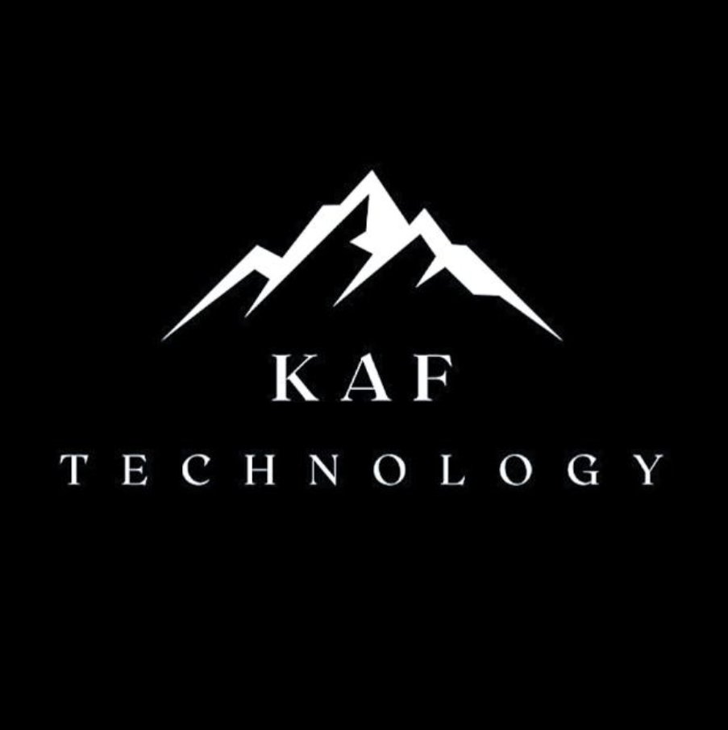
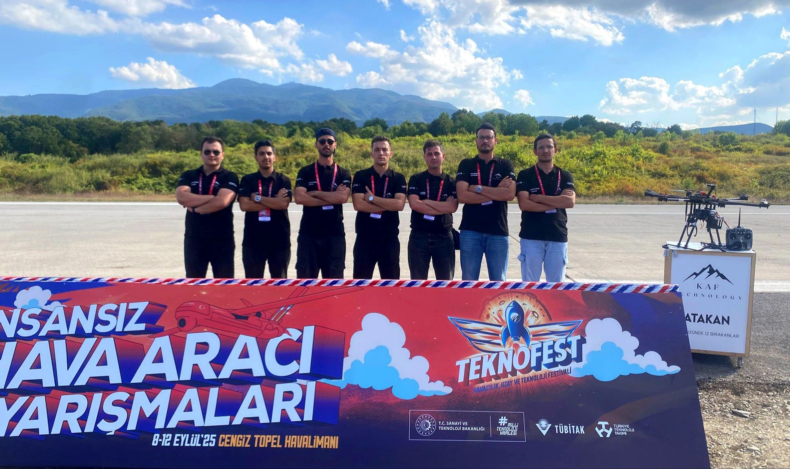

<div align="center">
  

  # KAF TECHNOLOGY PROJECTS

  **Teknofest İnsansız Hava Aracı Yarışması · Teknofest Savaşan İHA Yarışması**

  
  
  
  
  
  

</div>

---

## 🇹🇷 Türkçe

### Takım Hakkında

**KAF Technology**, Teknofest İnsansız Hava Aracı Yarışması ve Teknofest Savaşan İHA Yarışması'na katılan otonom İHA sistemleri geliştiren bir teknoloji takımıdır. Python, ROS, Gazebo ve YOLO kullanarak geliştirilen tam otonom görev algoritmalarını bu repoda bulabilirsiniz.

---

### 👥 Takım

<div align="center">
  
  <br/><br/>
  <em>KAF Technology Takımı — Teknofest 2025 · Cengiz Topel Havalimanı · 8-12 Eylül 2025</em>
</div>

---

### 🎥 Görev Videoları

| # | Video Başlığı | İlgili Proje | Link |
|---|---------------|--------------|------|
| 1 | 🔄 Drone ile 8 Çizme | Drone Kontrol & Manevra | [](https://www.youtube.com/watch?v=-3l6RibzhVU) |
| 2 | 🎯 Drone Hedef | [Talon-Hedef](./Talon-Hedef/) | [](https://www.youtube.com/watch?v=W8S8yLs4SQ4) |
| 3 | 🚀 KAF Technology 2025 Teknofest Uluslararası İHA Yarışması Finali | Tüm Proje | [](https://www.youtube.com/watch?v=HJHqJXLqcUU) |
| 4 | 📷 QR Okuma | [Talon-QRKOD](./Talon-QRKOD/) | [](https://www.youtube.com/watch?v=T32rkH-ke4E) |
| 5 | 🔭 Talon Takip | [Talon-Hedef](./Talon-Hedef/) | [](https://www.youtube.com/watch?v=Io_pixyaQkQ) |

---

### 📂 Projeler

| Klasör | Açıklama |
|--------|----------|
| [📁 Drone-Ucgen-Algılama-Yolo-Model](./Drone-Ucgen-Algılama-Yolo-Model/) | Drone kamerası ile YOLO modeli kullanarak üçgen şekil tespiti |
| [📁 Drone-Ucgen-Altigen-Droneda](./Drone-Ucgen-Altigen-Droneda/) | Gerçek drone üzerinde üçgen ve altıgen algılama + servo motor |
| [📁 Drone-Ucgen-Altigen-Gazebo](./Drone-Ucgen-Altigen-Gazebo/) | Gazebo simülasyonunda üçgen ve altıgen algılama (ROS) |
| [📁 Talon-Hedef](./Talon-Hedef/) | Talon ile otonom hedef takibi + kamikaze görevi |
| [📁 Talon-PRM-Algoritması](./Talon-PRM-Algoritması/) | Talon için PRM tabanlı otonom yol planlama algoritması |
| [📁 Talon-QRKOD](./Talon-QRKOD/) | Talon ile uçuş sırasında QR kod okuma görevi |

---

### ⚙️ Kurulum

```bash
# Repoyu klonla
git clone https://github.com/kaf-technology/KAF-Technology-Projects.git
cd KAF-Technology-Projects

# Bağımlılıkları yükle
pip install -r requirements.txt

# ROS workspace (Gazebo projeleri için)
cd Drone-Ucgen-Altigen-Gazebo/ros_ws
catkin_make
source devel/setup.bash
```

### 📋 Gereksinimler

- Python 3.10+
- ROS Noetic
- Gazebo 11
- OpenCV 4.x
- YOLOv8 (ultralytics)
- NumPy, pymavlink, dronekit, pyzbar

---

## 🇬🇧 English

### About the Team

**KAF Technology** is an autonomous UAV systems development team competing in the Teknofest Unmanned Aerial Vehicle Competition and Teknofest Combat UAV Competition. This repository contains all mission algorithms developed using Python, ROS, Gazebo, and YOLO.

---

### 👥 Team

<div align="center">
  
  <br/><br/>
  <em>KAF Technology Team — Teknofest 2025 · Cengiz Topel Airport · September 8-12, 2025</em>
</div>

---

### 🎥 Mission Videos

| # | Video Title | Related Project | Link |
|---|-------------|-----------------|------|
| 1 | 🔄 Drawing Figure-8 with Drone | Drone Control & Maneuver | [](https://www.youtube.com/watch?v=-3l6RibzhVU) |
| 2 | 🎯 Drone Target | [Talon-Hedef](./Talon-Hedef/) | [](https://www.youtube.com/watch?v=W8S8yLs4SQ4) |
| 3 | 🚀 KAF Technology 2025 Teknofest International UAV Competition Final | Full Project | [](https://www.youtube.com/watch?v=HJHqJXLqcUU) |
| 4 | 📷 QR Code Reading | [Talon-QRKOD](./Talon-QRKOD/) | [](https://www.youtube.com/watch?v=T32rkH-ke4E) |
| 5 | 🔭 Talon Tracking | [Talon-Hedef](./Talon-Hedef/) | [](https://www.youtube.com/watch?v=Io_pixyaQkQ) |

---

### 📂 Projects

| Folder | Description |
|--------|-------------|
| [📁 Drone-Ucgen-Algılama-Yolo-Model](./Drone-Ucgen-Algılama-Yolo-Model/) | Triangle shape detection using YOLO model from drone camera |
| [📁 Drone-Ucgen-Altigen-Droneda](./Drone-Ucgen-Altigen-Droneda/) | Triangle & hexagon detection on real drone + servo motor |
| [📁 Drone-Ucgen-Altigen-Gazebo](./Drone-Ucgen-Altigen-Gazebo/) | Triangle & hexagon detection in Gazebo simulation (ROS) |
| [📁 Talon-Hedef](./Talon-Hedef/) | Autonomous target tracking + kamikaze mission with Talon |
| [📁 Talon-PRM-Algoritması](./Talon-PRM-Algoritması/) | PRM-based autonomous path planning algorithm for Talon |
| [📁 Talon-QRKOD](./Talon-QRKOD/) | QR code reading mission during flight with Talon |

---

### ⚙️ Installation

```bash
# Clone the repo
git clone https://github.com/kaf-technology/KAF-Technology-Projects.git
cd KAF-Technology-Projects

# Install dependencies
pip install -r requirements.txt
```

---

<div align="center">
  
  <br/>
  <sub>Made with ❤️ by KAF Technology · Teknofest 2025</sub>
</div>
